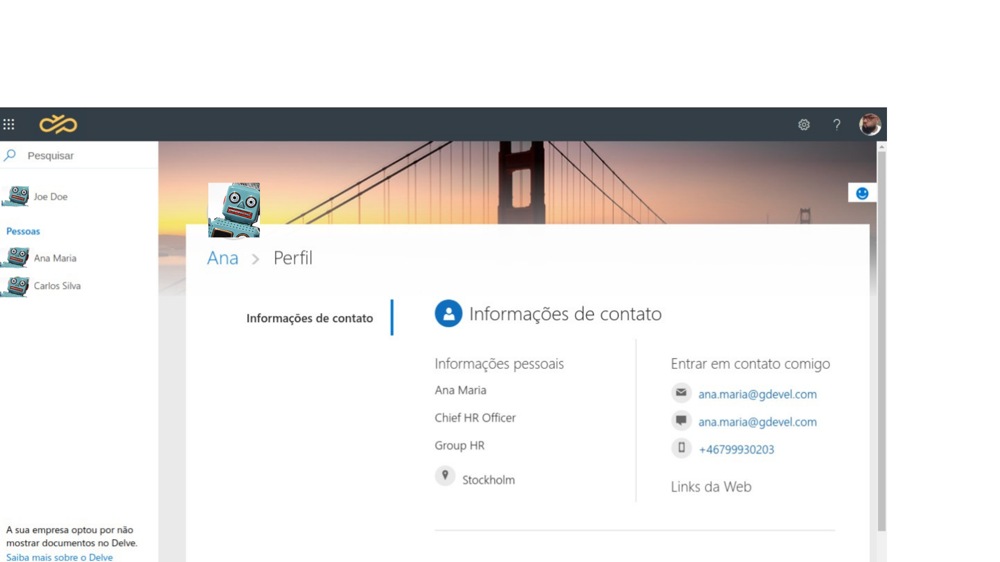
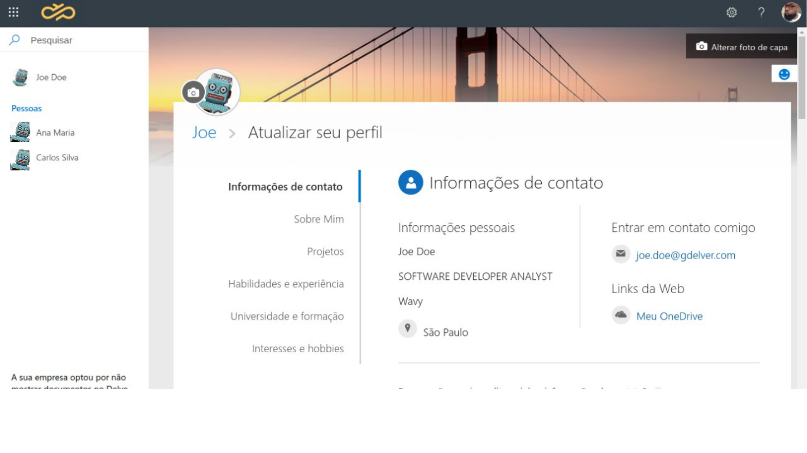
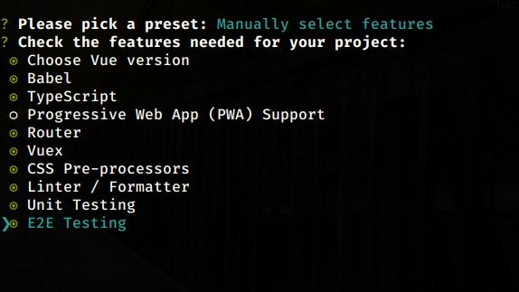
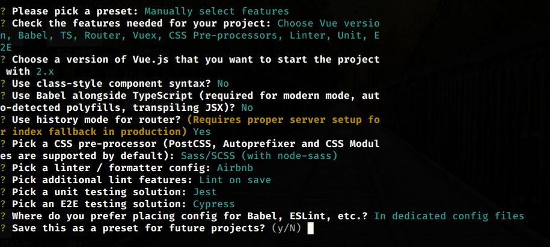
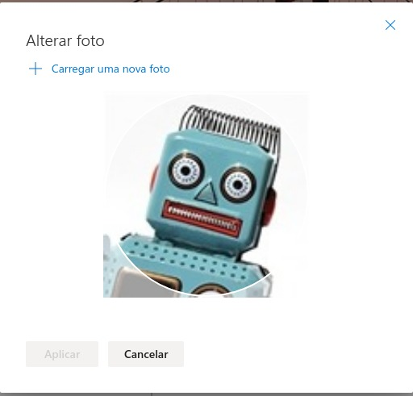

## {DE}code Frontend to Empower

 > Programa de mentoria para pessoas que atuam como front-end

## Objetivo: 
Estamos na reta final para você fazer parte da nossa tripulação, você já concluiu duas etapas. :heart_eyes: :trophy:	

- [x] Etapa: Processo de seleção de pessoas desenvolvedoras.  *done*
- [x] Etapa: Processo de seleção avaliando sua expertise técnica. *done*
- [ ] Etapa: Processo avaliativo desafio técnico e teórico. *to-do*
- [ ] Etapa: Feedback People to DEcode to Empower. *to-do* 

Agora, iremos avaliar como você lida no seu dia a dia com desafios que podem surgir durante o desenvolvimento de funcionalidades.

## Tecnologias

Abaixo listamos as principais tecnologias que deverão ser analisadas durante o seu desafio, sinta-se livre para sugerir novas tecnologias ou bibliotecas que julgar necessário para o desenvolvimento do desafio.

- Vue2 | [referência](https://vuejs.org/)
- Vuetify | [referência](https://vuetifyjs.com/en/)
- Vuex | [referência](https://vuex.vuejs.org/)
- TypeScript | [referência](https://www.typescriptlang.org/)
- Testes Unitários: [Vue-Test-Utils](https://vue-test-utils.vuejs.org/) e [Jest](https://jestjs.io/pt-BR/)
- Testes de Integração: [Cypress](https://www.cypress.io/)

## Desafio: 

O desafio se complementa em duas etapas sendo uma parte teórica e uma parte prática, o nosso objetivo com esse desafio é avaliar como você evolui o desenvolvimento de uma "mini-app" validando casos de uso comum e alternativo e como se desenvolve em torno das tecnologias citadas no tópico citado. Vamos lá!?

### Resumo:

O DelveApp se trata de um webApp similar ao linkedin, só que ao invés dele conectar pessoas de forma pública ele é para as empresas internas. Mais informações a respeito do [Delve](https://support.microsoft.com/pt-br/office/o-que-%C3%A9-o-delve-1315665a-c6af-4409-a28d-49f8916878ca).

Uma visão geral de como é o Delve pode ser vista na imagem abaixo:


É comum em todas as aplicações web, termos uma área de usuário onde ele pode visualizar suas informações como:
- Nome
- E-mail 
- Telefone
- Endereço
- Foto

Pode ocorrer de ter mais informações que a aplicação julga necessária para que o usuário insira. Com base nisso, precisamos elaborar uma página de perfil para visualizar essas informações e outra para editar essas informações, levando em consideração algumas diretrizes de User Interface do Delve.

### Desafio Técnico:

> Na rota da página visualizar perfil:

1. Precisamos desenvolver um layout de duas colunas, onde temos:
 - Sidebar: Foto, Nome, Cargo, Cidade/Estado
 - Content: Cards de informações para visualização e edição.

 

> Na rota da página edição de perfil:

2. Precisamos fornecer condições para que seja atualizado as informações do usuário para que seja exibida no Sidebar, para o carregamento inicial pode exibir informações randômicas com o uso da API [RandomUser](https://randomuser.me/)

3. Precismos fornecer condições para que seja atualizado seu endereço, para isso podemos adotar as informações da API [Postmon](https://postmon.com.br/)

4. Para fazermos upload da foto do usuário podemos adotar a API [Cloudinary](https://cloudinary.com/documentation/vue_image_and_video_upload);


5. Layout do perfil possui as seguintes sessões para edição:

- Informações de contato
- Sobre Mim
- Projetos
- Habilidades e experiência
- Universidade e formação
- Interesses e hobbie



Abaixo segue um gif para ver o comportamento de cada section de inclusão do perfil.


## Resumo geral:

Nosso projeto basicamente lida com duas rotas:

- /user 
- /user/edit 

Para que possamos fazer a estrutura do layout de 2 colunas, pode ser adotado:

- flex-box
- css-grid
- float

Para que possamos fazer o consumos das API's listada, podemos usar um httpClient famoso que se trata do [axios](https://github.com/axios/axios), basicamente iremos fazer utilizar metodo http `get` para buscar as informações e o método `post` para submeter os dados que julgar necessário.

Quando o usuário clicar em salvar as informações elas precisam ser instanciadas em algum local para que possam ser visualizadas, por exemplo:

- LocalStorage | [referência](https://developer.mozilla.org/pt-BR/docs/Web/API/Window/localStorage)
- JsonServer | [referência](https://www.npmjs.com/package/json-server)
- Firebase | [referência](https://firebase.google.com/?hl=pt-br)


## Dicas:

1. Crie um repositório privado no github e sinalize meu usuário: *cristofer-sousa-movile*

2. Crie branch de forma incremental para seu projeto, para que possamos ajudar na sua linha de raciocinio.

3. Crie um projeto adotando o [vue-cli](https://cli.vuejs.org/) com as configurações citadas no tópico tecnologia, abaixo segue um help:
 
 > npm i -g @vue/cli 
 > vue create decode-project

 

3.1 Inicie o projeto como vue2 e não com vue3 pois o vuetify não possui suporte para vue3.

```bash
 Choose a version of Vue.js that you want to start the project
 with (Use arrow keys)
❯ 2.x 
  3.x (Preview)
```

3.2 Configuração de um setup inicial para o seu projeto usando vue-cli ficaria dessa forma:



**Observação:** Sinta-se livre para fazer a configuração que for mais viável para você.

4. Crie pull-request necessários para segmentar seu código.

5. Opcional: Caso deseja fazer deploy dele em algum ambiente na nuvem recomendo alguns providers abaixo:

- [Surge](https://surge.sh/)
- [Heroku](https://www.heroku.com/)
- [Netlify](https://www.netlify.com/)

6. Wireframes para ajudar mais na concepção do desenvolvimento:


> upload profile photo





> upload cover background


> Referência de estudo:

0. [Structure APP](https://www.youtube.com/watch?v=dIkPb8krORU&ab_channel=Academind)
1. [Vuetify + Firebase](https://www.youtube.com/watch?v=FXY1UyQfSFw&list=PL55RiY5tL51qxUbODJG9cgrsVd7ZHbPrt)
2. [Upload Images](https://www.youtube.com/watch?v=FXY1UyQfSFw&list=PL55RiY5tL51qxUbODJG9cgrsVd7ZHbPrt&ab_channel=Academind)
3. [Manager State - Vuex](https://www.youtube.com/playlist?list=PL55RiY5tL51pT0DNJraU93FhMzhXxtDAo)

## Conclusão:

Separe o projeto em partes, faça com calma iremos falar no decorrer dos dias sobre a evolução do mesmo. Esse projeto basicamente ele supre 70% da demanda necessária que você verá no dia-a-dia conosco ou em qualquer projeto web que deseja trabalhar. 

- Consumo de API
- Formulários
- Biblioteca de Componentes
- Componentização
- Gerenciamento de Estado
- Testes Automatizados

Qualquer grilo, me chame! Boa sorte, queremos você no time! =)

